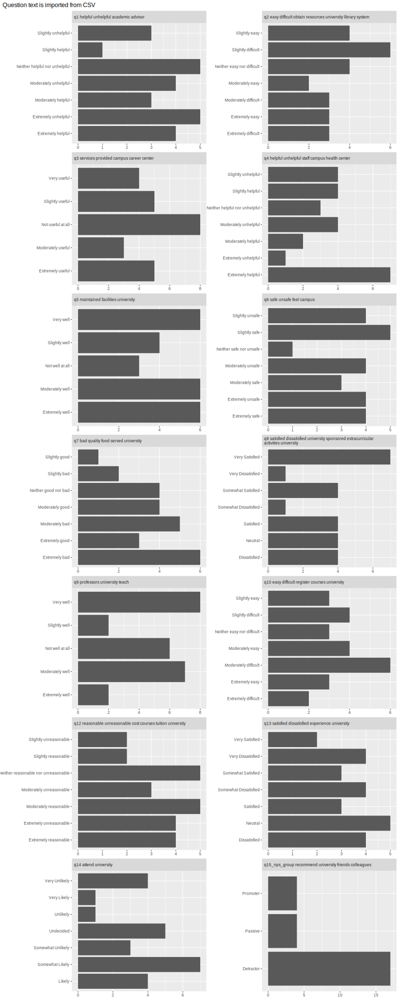

# README

<!-- badges: start -->

<!-- badges: end -->

There are many options for formatting exported Qualtrics data. The two examples show here demonstrate importing labeled data verses importing CSV or Excel data formats. There are pros and cons to each approach. The data in this repository is randomly generated test data.

Labeled data are imported in the `labeled_data.qmd` code notebook.

CSV data are imported in the `csv_data.qmd` code notebook.

### Shortcut

The coding technique for importing labeld data uses the haven package

```         
my_df  <- read_sav("data/my_file.sav")

# convert just one variable. e.g. `q1`

## single variable example

my_student_survey_spss_sas |> 
  select(q1) |> 
  mutate(q1_label = as_factor(q1)) 


## across all 'labeled' variables

# convert labeled data to factors in R
my_df |> 
  mutate(across(is.labelled, ~ as_factor(.x), .names = "{.col}_label"))
```

### Example



